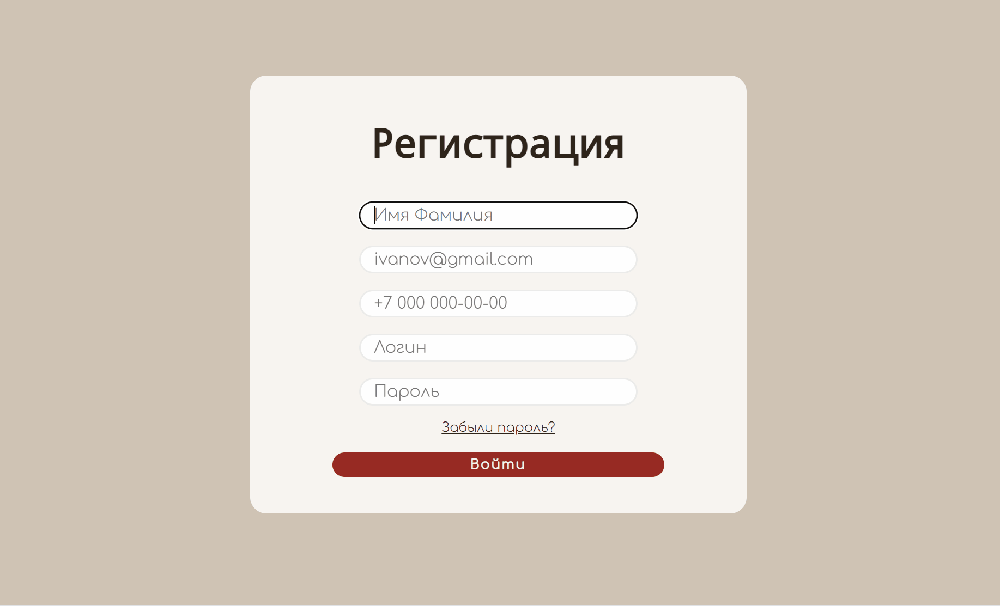

# Проект: "Форма для регисттрации"

## Описание проекта
Шаблон формы для регистрации вашего сайта.

## Цели проекта
Создание формы регистрации пользователя с обязательными для заполнения полями.

## Используемые технологии
- `HTML` для разметки и подключения функций сайта.
- `CSS` для придания красок сайту.

## Пример запуска
Для запуска проекта установите все файлы на свой компьютер, и откройте файл `index.html`.

В поле есть поля для заполнения:
- `Имя Фамилия`
- `Адрес Эл. Почты`
- `Номер телефона`
- `Логин`
- `Пароль`

Чтобы их заполнить, нужно ввести нужные данные в соответствующие поля, а после нажать на кнопку "Регистрация"
Также внизу кнопки для отправки формы есть ссылка "Забыли пароль?". Вы можете добавить ссылку на сброс пароля через почту или номер телефона по вашему усмотрению.

## Пример использования

### Проект выполнен в образовательных целях на онлайн-курсе "Основы Веб-разработки школы "Лидер".

